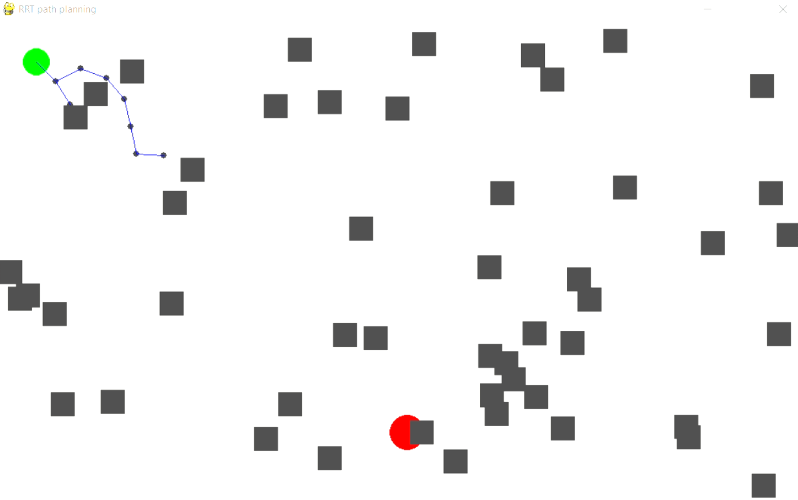
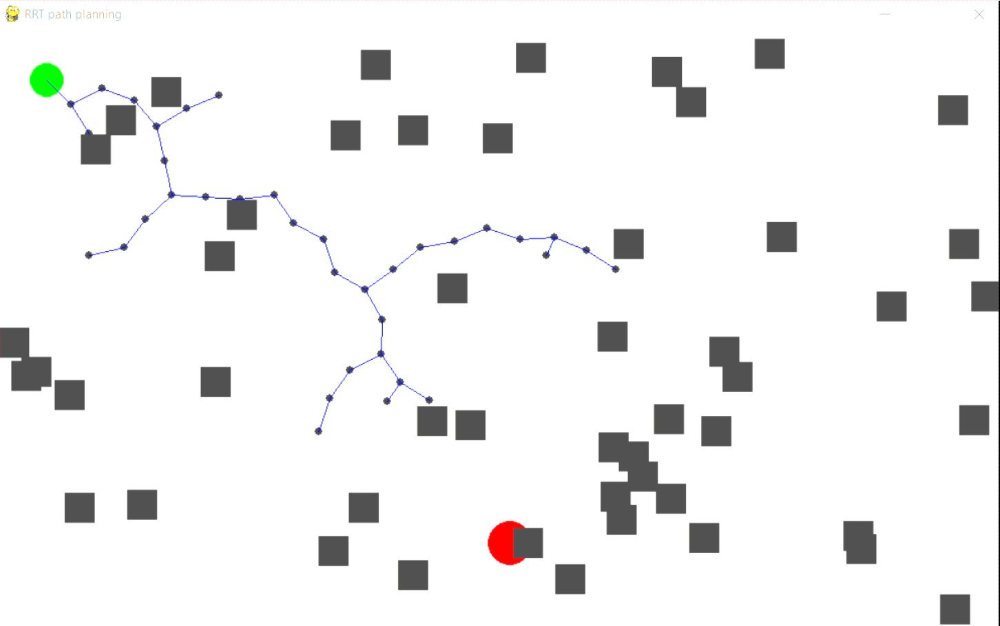
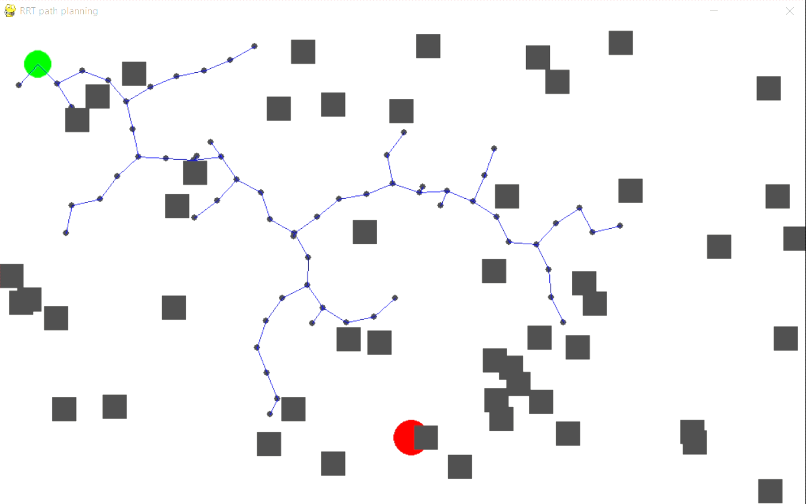
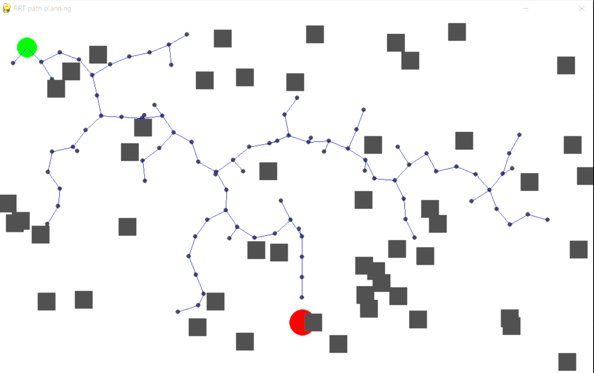
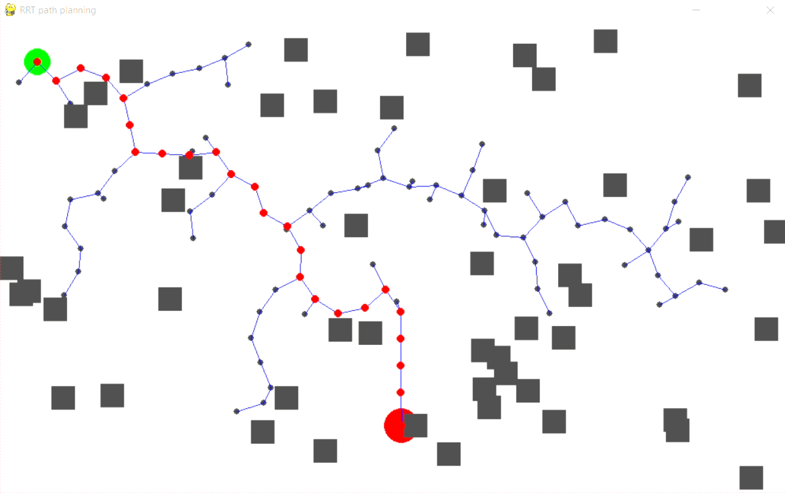

# RRT_Algorithm
This is the git repository where I implement RRT algorithm with python 
In robotic path planning problem is a classic. A robot, with certain dimensions, is attempting to navigate between point A and point B while avoiding the set of all obstacles,
## RRT
The premise of RRT is actually quite straight forward. Points are randomly generated and connected to the closest available node. Each time a vertex is created, a check must be made that the vertex lies outside of an obstacle. Furthermore, chaining the vertex to its closest neighbor must also avoid obstacles. The algorithm ends when a node is generated within the goal region, or a limit is hit.

RequiredRRT.py contains the all the required methods and class to implement the RRT algorithum while RRT.py show the window where RRT is implemented.

steps to implement the RRT is as follows :
first we cteate a window of dimention 600 X 1000
- First create window with given number of obstacles with the makeObs() method in the RRTGraph class and show it on over map with drawObs() method from RRTMap class also draw start and goal point on it
- Second we create a node and draw it on map
    - we create a random node on the graph 
    - find the position of the node in that direction at a particular distance and check it not overlapping the obstacle rectangle
    - check which node is nearest from the node previously created node to the newly created and draw line
- Third check we reach near to goal if yes then find the reverse path to that goal and terminate generating and drawing random new node
- show the path on the map

- 
- 
- 
- 
- 

